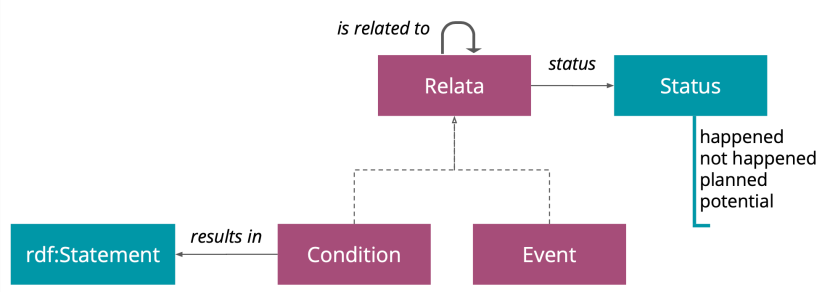
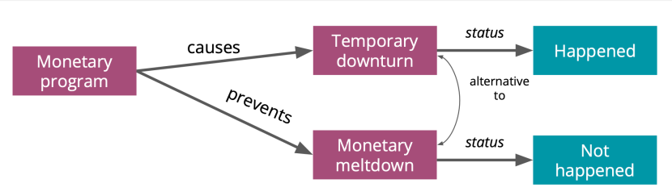

# FARO: Facts and Events Relationship Ontology

FARO is an ontology in OWL for representing events relationships in Knowledge Graphs, in which the connections between two consecutive points have explicit semantics.

The complete documentation is availabe at http://anr-kflow.github.io/faro

## Ontology overview

FARO includes two different classes, *Condition* -- transcendent, possibly can result in a RDF statement -- and *Event* -- immanent -- that are direct children of the more general class *Relata*. The latter is not intended to be directly use for instantiate entities, but is rather an abstraction layer for the other two main classes, allowing to define relations which connects indiscriminately any combination of them.

Two *Relata* instances can be connected with a *related to* property, which suggests general relatedness without further specification. The *related to* property is further extended by 24 more specific properties, organised around four direct sub-classes of *related to*.

Here an example of usage:

<!-- java -jar java-17-widoco-1.4.17-jar-with-dependencies.jar -ontFile faro.ow
l -outFolder . -getOntologyMetadata -rewriteAll
 -->
